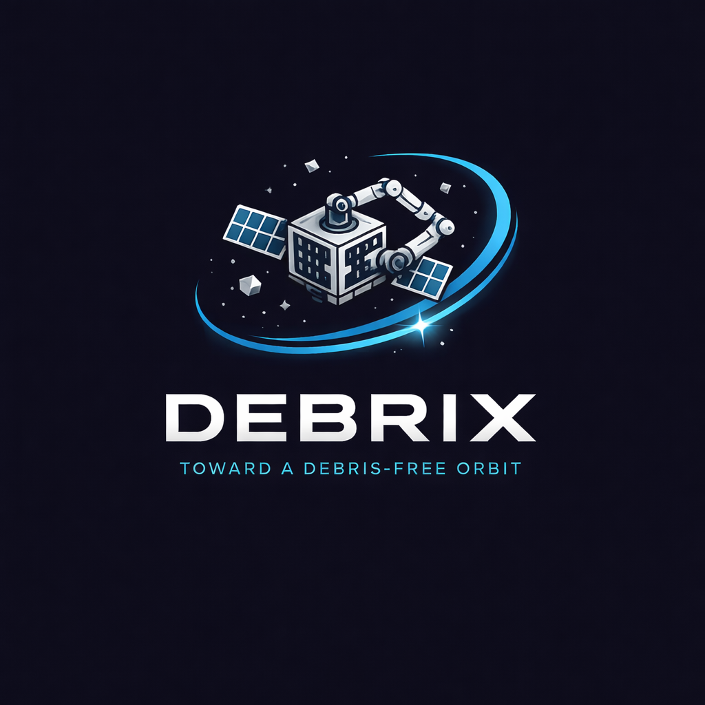

# 🛰️ DEBRIX — Toward a Debris-Free Orbit

<p align="center">
  
</p>

<p align="center">
  <strong>Smart Satellites for Orbital Cleanup and Space Sustainability</strong>
</p>

<p align="center">
  <a href="#mission">Mission</a> •
  <a href="#the-problem">The Problem</a> •
  <a href="#how-it-works">How It Works</a> •
  <a href="#features">Features</a> •
  <a href="#tech-stack">Tech Stack</a> •
  <a href="#team">Team</a> •
  <a href="#getting-started">Getting Started</a>
</p>

---

## 🌍 Mission

**DEBRIX** (Debris Removal by Intelligent eXploration) is an autonomous swarm-based satellite system designed to **detect, capture, collect, and safely deorbit** space debris — protecting critical orbital infrastructure and ensuring sustainable access to space for future generations.

## ⚠️ The Problem

Space debris is one of the most critical challenges facing humanity's future in orbit:

- **36,500+** tracked debris objects larger than 10 cm in LEO
- **1,000,000+** fragments between 1–10 cm — too small to track, large enough to destroy
- **130,000,000+** sub-centimeter particles traveling at **7.5 km/s**
- Each collision generates **thousands** of new fragments — fueling the **Kessler Syndrome**
- At risk: GPS, weather forecasting, telecommunications, ISS crew safety, and the $400B+ satellite economy

**If we don't act now, critical orbits could become unusable within decades.**

## 🚀 How It Works

DEBRIX operates through a 4-phase autonomous mission cycle:

| Phase | Description |
|-------|-------------|
| **1. Launch** | DEBRIX swarm satellites are deployed into target orbital zones via rideshare launches |
| **2. Orbit & Detect** | AI-powered onboard sensors identify, classify, and prioritize debris targets in real-time |
| **3. Capture & Dock** | Individual swarm units rendezvous with debris using robotic arms, then dock with a central "Garbage Satellite" |
| **4. Controlled De-orbit** | The fully-loaded garbage satellite performs a controlled atmospheric reentry, safely burning up all collected debris |

### Key Technologies
- **Swarm Intelligence** — Multiple satellites coordinate autonomously to cover vast orbital zones
- **AI-Powered Detection** — Onboard ML models classify debris by size, trajectory, and collision risk
- **Dock & Dump Architecture** — Efficient transfer of captured debris to a centralized deorbit vehicle
- **Collision Avoidance AI** — Real-time trajectory prediction and autonomous maneuvering

## ✨ Features

This interactive web platform showcases the DEBRIX mission with **25+ sections**:

### 🛰️ Space Debris & Orbital Monitoring
- **Real-time Debris Tracker** — Track debris objects orbiting Earth
- **Collision Avoidance System** — AI-powered collision prediction and maneuvering
- **Debris Prioritization Engine** — Classify and rank debris by threat level
- **Kessler Syndrome Visualizer** — See the cascading collision effect in action
- **Orbital Decay Simulator** — Model how debris naturally decays over time
- **Debris Growth Projections** — Interactive charts showing debris population trends
- **Dock & Dump Architecture** — Visualize the debris capture and deorbit workflow

### 🌞 Space Weather & Re-Entry
- **Space Weather Intelligence** — Solar flare alerts, geomagnetic storm predictions, and satellite risk assessment (NOAA/NASA data)
- **Re-Entry Prediction System** — Track objects falling back to Earth with probability heatmaps and ground track visualization

### 🔭 Astronomy & Sky Observation
- **Interactive Sky Map** — Zoomable/draggable star chart with 240+ stars and constellation overlays
- **Planet Visibility Tonight** — Real-time visibility tracker for 7 planets with rise/set times and orbit diagrams
- **NASA APOD** — Daily astronomy picture from NASA's API
- **Global Telescope Network** — Browse and book telescope time from stations worldwide

### 🚀 Rockets & Launch Intelligence
- **SpaceX-style Launch Simulation** — 7-phase interactive launch sequence with 3D graphics and live telemetry
- **Rocket Engine Database** — Searchable reference of 12+ engines with thrust, ISP, fuel type, and cycle details
- **Space Events Tracker** — Upcoming launches worldwide with countdowns and mission details

### 📡 Satellite Intelligence
- **Real-time ISS Tracker** — Live position tracking using actual orbital data
- **Satellite Dashboard** — Real-time stats on active satellites, debris counts, Starlink constellation, and pass predictions
- **Satellite Mission Analyzer** — Interactive orbit simulation with lifetime estimation, coverage visualization, and fuel depletion

### 🤖 AI & Interaction
- **K2 AI Assistant** — Space-focused chatbot powered by AI
- **Swarm Visualization** — 3D simulation of coordinated debris capture
- **Mission Timeline** — Interactive history of space exploration milestones

### 🎨 Platform
- **Dark/Light Theme** — Toggle between mission control dark mode and daylight mode
- **Responsive Design** — Full mobile and desktop support
- **Contact System** — Get in touch with the DEBRIX team

## 🛠️ Tech Stack

| Layer | Technology |
|-------|-----------|
| Frontend | React 18, TypeScript, Vite |
| Styling | Tailwind CSS, shadcn/ui |
| 3D Graphics | Three.js, @react-three/fiber |
| Animations | Framer Motion |
| Maps | Leaflet (ISS tracker) |
| Charts | Recharts |
| State | Zustand, TanStack Query |
| Backend | Lovable Cloud (Edge Functions) |
| AI | Lovable AI (K2 Chat) |

## 👥 Team

### Faculty Advisor

| Name | Role | Links |
|------|------|-------|
| **Dr. Subbaiah Muthu Prabhu** | Faculty Advisor & Mentor | [Google Scholar](https://scholar.google.com/citations?user=D3A13LgAAAAJ&hl=en) · [LinkedIn](https://www.linkedin.com/in/subbaiah-muthu-prabhu-a10762ba) |

### Team Members

| Name | Role | Specialization | Links |
|------|------|---------------|-------|
| **V C Premchand Yadav** | Team Lead | CSE (AI & ML) | [LinkedIn](https://www.linkedin.com/in/v-c-premchand-yadav-a785691a2/) · [GitHub](https://github.com/Premchandyadav369) |
| **Edupulapati Sai Praneeth** | AI Engineer | CSE (AI & ML) | [LinkedIn](https://www.linkedin.com/in/edupulapatisaipraneeth/) · [GitHub](https://github.com/SaiPraneeth-E) |
| **Yamala Liel Stephen** | Full Stack Developer | CSE (AI & ML) | [LinkedIn](https://www.linkedin.com/in/liel-stephen-17a06b295/) · [GitHub](https://github.com/LielStephen) |
| **Sri Harsha Vardhan K** | 3D Architect & Designer | CSE (AI & ML) | [LinkedIn](https://www.linkedin.com/in/kurapati-sri-harshavardhan-025263290/) · [GitHub](https://github.com/MrAlhm-harsha) |
| **Sai Krishnan Iyer** | Orbital Mechanics & Simulation | Computer Science & Engineering | [LinkedIn](https://www.linkedin.com/in/sai-krishnan-iyer-b14570289/) |
| **Chinna Reddy Gari Mohith** | Software Engineering | Integrated M.Tech (Software Engineering) | [LinkedIn](https://www.linkedin.com/in/mohith-reddy-cr-87a585292/) · [GitHub](https://github.com/mohithreddy2810-ops) |

## 🏁 Getting Started

```bash
# Clone the repository
git clone <YOUR_GIT_URL>

# Navigate to the project
cd debrix

# Install dependencies
npm install

# Start development server
npm run dev
```

The app will be available at `http://localhost:5173`

## 📁 Project Structure

```
src/
├── assets/          # Brand assets (logos, images)
├── components/      # All UI components
│   ├── ui/          # Reusable shadcn/ui components
│   ├── HeroSection  # Landing hero with 3D satellite
│   ├── LaunchSim    # Interactive launch simulation
│   ├── SwarmSection # Swarm coordination visualization
│   ├── SkyMapSection        # Interactive star chart
│   ├── PlanetVisibility     # Planet visibility tracker
│   ├── RocketEngineDatabase # Engine reference database
│   ├── SpaceWeather         # Solar activity monitor
│   ├── ReentryPrediction    # Re-entry tracking system
│   ├── TelescopeNetwork     # Global telescope booking
│   ├── MissionAnalyzer      # Satellite mission simulator
│   ├── TeamSection          # Team & faculty information
│   └── ...          # 25+ mission-specific sections
├── hooks/           # Custom React hooks (theme, mobile, etc.)
├── integrations/    # Backend client setup
├── pages/           # Route pages
└── lib/             # Utilities
```

## 🌐 Deployment

This project is deployed via [Lovable](https://lovable.dev). Click **Share → Publish** to deploy.

## 📜 License

This project is developed as part of the DEBRIX space sustainability initiative.

---

<p align="center">
  <em>Cleaning orbits, one debris at a time.</em> 🛰️✨
</p>
